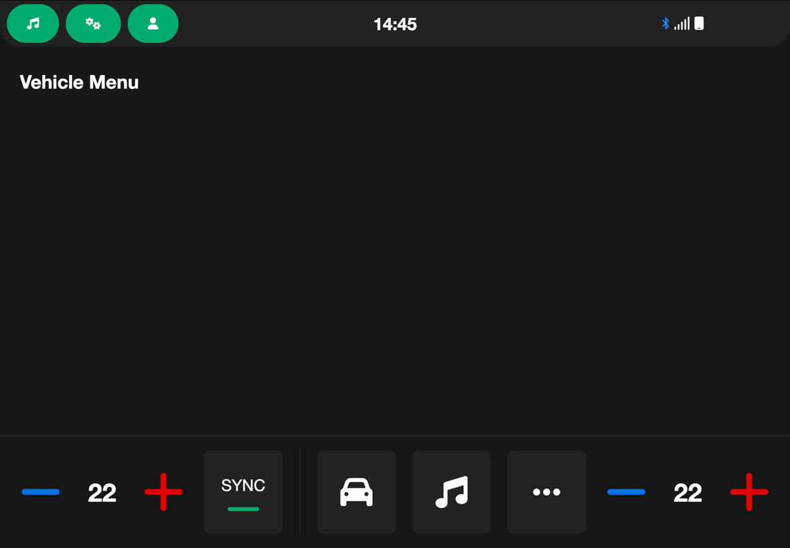
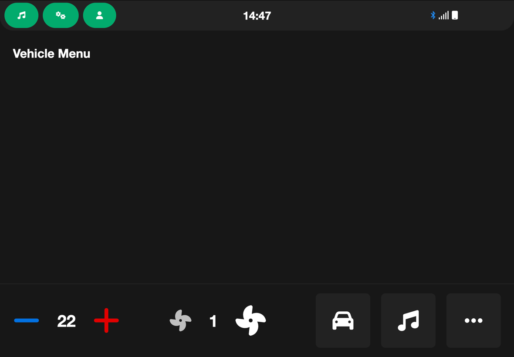

#  HTML Car Infotainment
**This is not an actual infotainment screen.**\
It is a **simulated** interactive infotainment center screen of modern vehicles.

This project is for one of my BeamNG.drive mods.

The Development is **very** slow since I don't have that much spare time for it.

### Current Features:
* simplistic design
* Functional clock
* Interactive AC controls
* relatively easily customizability

**more features are yet to come**

## Current state of the project
screen with automatic AC:

screen with manual AC:
